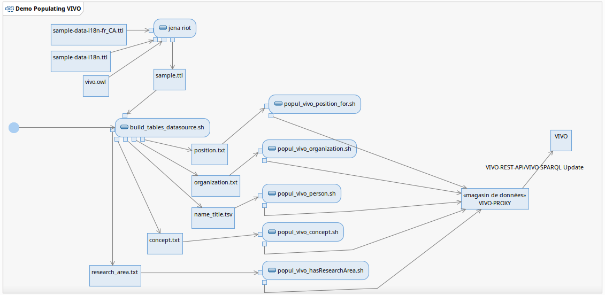

# Summary
> This directory contains the programs needed to evaluate the capabilities of VIVO-Proxy. It is from the i18n data extracted from the repo [https://github.com/vivo-project/sample-data](https://github.com/vivo-project/sample-data) that the applications in this demo are used to populate a local VIVO instance from VIVO-PROXY
___
# Usage

## Prerequisites

- Java 1.11
- Maven
- Linux Ubuntu
- Bash
- Jena 3.17.0 
- ImageMagik
- curl
- VIVO 1.12.0 including [Pull-Request 250](https://github.com/vivo-project/VIVO/pull/250/) or [https://github.com/UQAM-SB/VIVO/tree/VIVO-2008](https://github.com/UQAM-SB/VIVO/tree/VIVO-2008)

## Structure of the demo bundles
> The following tree structure shows the distribution of the different components needed to run the VIVO-PROXY demo.
The `bash` directory contains a set of scripts used in the demo. 
The `java` directory is currently empty, but it may contain some code needed for the demo
The directories `resources/data`, `resources/images`, `resources/query` contain respectively: the tables produced by the script `build_table_datasource.sh`, the images used for each person and the data extraction queries coming from the [sample-data of the VIVO project on github](https://github.com/vivo-project/sample-data) used to produce `sample.ttl`

```
.
├── bin
├── README_en.md
├── README_fr.md
└── src
    └── main
        ├── bash
        │   ├── build_sample.sh
        │   ├── build_table_datasource.sh
        │   ├── env.sh
        │   ├── get_indv_byLabel.sh
        │   ├── json2txt.sh
        │   ├── popul_vivo_concept.sh
        │   ├── popul_vivo_hasResearchArea.sh
        │   ├── popul_vivo_organization.sh
        │   ├── popul_vivo_person.sh
        │   ├── popul_vivo_position_for.sh
        │   └── upper_first_letter.sh
        ├── java
        └── resource
            ├── data
            │   ├── concept.txt
            │   ├── name_title.tsv
            │   ├── organization.txt
            │   ├── position.txt
            │   └── research_area.txt
            ├── images
            │   ├── n1158.jpg
            │   ├── n1736.jpg
            │   ├── n476.jpg
            │   ├── n725.jpg
            │   └── n733.jpg
            ├── query
            │   ├── get_concept.ql
            │   ├── get_name_title.ql
            │   ├── get_organization.ql
            │   ├── get_position.ql
            │   └── get_researchArea.ql
            ├── sample.ttl
            └── vivo.nt
```
## VIVO-Proxy API signature
 [see vivo-proxy.yaml from the web](https://editor.swagger.io/?url=https://raw.githubusercontent.com/vivo-community/VIVO-PROXY/main/bundles/ca.uqam.tool.vivo-proxy/api/vivo-proxy.yaml) 

___
# Quick Assessment
> This section consists of presenting the steps necessary to perform a quick assessment of the VIVO-PROXY function. 
The quick assessment consists of creating a person in VIVO by submitting a ***curl*** command of the person data encapsulated in a ***json*** structure.

## 1) Configure VIVO-Proxy
```
cd $PROXY_HOME/bundles/ca.uqam.tool.vivo-proxy
./script/start_vivo_proxy.sh
```
> Access the VIVO-PROXY api from the address [http://localhost:9090/](http://localhost:9090/) in a web browser
## 2) Install and start VIVO
> go to : [Lyrasis-DOC Installing VIVO](https://wiki.lyrasis.org/display/VIVODOC112x/Installing+VIVO)
## 3) Create a person with Curl via VIVO-PROXY
> Send this command in a ***bash*** script
```
curl -X 'POST' \
  'http://localhost:9090/vivoproxy/person' \
  -H 'accept: application/json' \
  -H 'Content-Type: application/json' \
  -d '{
  "personType": "http://vivoweb.org/ontology/core#FacultyMember",
  "firstName": [
    {
      "label": "Peter",
      "language": "fr-CA"
    },
    {
      "label": "Peter",
      "language": "en-US"
    }
  ],
  "lastName": [
    {
      "label": "Jasper",
      "language": "fr-CA"
    },
    {
      "label": "Jasper",
      "language": "en-US"
    }
  ]
}'
```
___
# Using VIVO-Proxy demo for batch processing of data
> This demonstration consists in performing the batch data loading in VIVO through the execution of a pre-programmed set of scripts
The ETL execution flow is segmented according to the following steps:
```
[sample.ttl] --> generate the data tables --> for each table; run the population script --> [VIVO-PROXY] --> [VIVO] 
```
## Demo execution flow
The detail of the flow is shown here: 
 


- The first step is to create the `sample.ttl` file from the knowledge graphs extracted from [Vivo Project Sample Data](https://github.com/vivo-project/sample-data). In the ETL process, the `sample.ttl` file represents the original data source from which the data are extracted.
- The second step is to transform the data from `sample.ttl` into a tabular form representing the VIVO data structure. For example: people, organization, concepts, etc.
- The third step is to transform the data from the tabular form into ***json*** format ready to be submitted to VIVO-PROXY for storage in VIVO

## Execution
> Notes: make sure VIVO and VIVO-PROXY are started

```
# 1- Creating the sample.ttl file
cd $VIVO-PROXY_HOME/bundles/ca.uqam.tool.vivo-proxy.demo/src/main/bash
bash$ ./build_sample.sh
build sample.ttl

# 2- Creating tables
bash$ ./build_tables_datasource.sh
build name_title.tsv
build organization.txt
build position.txt
build concept.txt
build research.txt
build_tables_datasource.sh.sh DONE! 

# 3 Loading data into VIVO via VIVO-PROXY
# 3 a) People and their photo
bash$ ./popul_vivo_person.sh
    ... CREATING person (Claudia Martinez) (http://localhost:8080/vivo/individual/n4854) done!
    ... processing photo (1/14) Claudia Martinez http://localhost:8080/vivo/individual/n4854 n1158  (560x600) (560,600)
    ... processing photo (1/14) Claudia Martinez http://localhost:8080/vivo/individual/n4854 n1158  Done !
Processing: (1/14) n1158 <http://localhost:8080/vivo_i18n/individual/n1158> http://vivoweb.org/ontology/core#NonFacultyAcademic Claudia Martinez
    ... ADDING person type (http://vivoweb.org/ontology/core#Postdoc) to (Claudia Martinez) at (http://localhost:8080/vivo/individual/n4854) is done!
Processing: (2/14) n1158 <http://localhost:8080/vivo_i18n/individual/n1158> http://vivoweb.org/o ...

# 3 b) organizations
bash$ ./popul_vivo_organization.sh
    ... CREATING organisation (http://vivoweb.org/ontology/core#AcademicDepartment) OR (Physique)/(Physics) AT (http://localhost:8080/vivo/individual/n4071) done!
Processing: (1/33) KEY=n1927 ID= <http://localhost:8080/vivo_i18n/individual/n1927>  TYPE=http://vivoweb.org/ontology/core#AcademicDepartment (Physique) (Physics)
    ... ADDING organisation (http://vivoweb.org/ontology/core#Department) FOR (Physique)/(Physics) AT (http://localhost:8080/vivo/individual/n4071) is done!
Processing: (2/33) KEY=n1927 ID= <http://localhost:8080/vivo_i18n/individual/n1927>  TYPE=http://vivoweb.org/ontology/core#Department (Physique) (Physics)
    ... ADDING organisation (http://xmlns.com/foaf/0.1/Organization) FOR (Physique) .....
    
# 3 c) concepts (areas of expertise)
bash$ ./popul_vivo_concept.sh 
Processing: (1/7) (Derrida) (Derrida)
    ... CREATING concept (Derrida) (Derrida) (http://localhost:8080/vivo/individual/n7224) done!
Processing: (2/7) (Civil War Reconstruction) (Reconstruction de la guerre civile)
    ... CREATING concept (Civil War Reconstruction) (Civil War Reconstruction) (http://localhost:8080/vivo/individual/n6053) done!
Processing: (3/7) (Rhetoric) (Rhétorique) ...

# 3 d) Associate a position with people
bash$ ./popul_vivo_position_for.sh 
Processing (1/23) (n1158) (Claudia) (Martinez) (Chercheur Associé) (Postdoctoral Researcher) (Physique) (Physics) (http://vivoweb.org/ontology/core#NonFacultyAcademicPosition)
    GET PERSON: Claudia Martinez
    GET ORGANIZATION: Physics
    PERS_IRI=(http://localhost:8080/vivo/individual/n4854) ORG_IRI=(http://localhost:8080/vivo/individual/n4071)
Done Claudia Martinez !
Processing (2/23) (n1158) (Claudia) (Martinez) (Chercheur Associé) (Postdoctoral Researcher) (Physique) (Physics) (http://vivoweb.org/ontology/core#Position) ...

# 3 e) Associate a research area with people
bash$ ./popul_vivo_hasResearchArea.sh 
Processing: (1/6) (Patricia Roberts) (Electracy) (Electracy)
    GET PERSON: Patricia Roberts
    GET AREA: Electracy
    CREATING hasResearchArea (Patricia Roberts) at (http://localhost:8080/vivo/individual/n7689) for (Electracy) at (http://localhost:8080/vivo/individual/n5017)  
    CREATING hasResearchArea (Patricia Roberts) at (http://localhost:8080/vivo/individual/n7689) for (Electracy) at (http://localhost:8080/vivo/individual/n7689)  ... done!
Processing: (2/6) (Patricia Roberts) (Political discourse) (Discours politique) ...

```
## Partial result

> The table below shows an illustration of the result using a VIVO screen capture
It shows that the name, photo, area of expertise and title of one of the people in `sample.ttl` are properly presented for both French and English

| Patricia Roberts (French)  | Patricia Roberts (English) |
|------------------------------|:--------------------------:|
|          |        |

___
# Conclusion
> The purpose of this page was to present the demonstration of VIVO-PROXY's use to produce a LOT feed of data into VIVO. 
After presenting the prerequisites necessary for its execution, the demonstration continued with a quick evaluation of the VIVO-PROXY capabilities, and then continued with a more extensive and in-depth evaluation of the apis that comprise VIVO-PROXY


